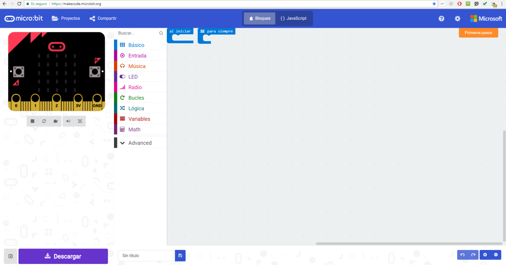

# 4.- MakeCode. Primeros pasos. {#4-makecode-primeros-pasos}

Como se vio anteriormente MakeCode se puede ejecutar online, si está disponible conexión a Internet u offline.

Para acceder directamente a la versión online de MakeCode para micro:BIT se debe introducir en el navegador la siguiente dirección: [https://makecode.microbit.org/](https://www.google.com/url?q=https://makecode.microbit.org/&sa=D&ust=1540996277380000)

