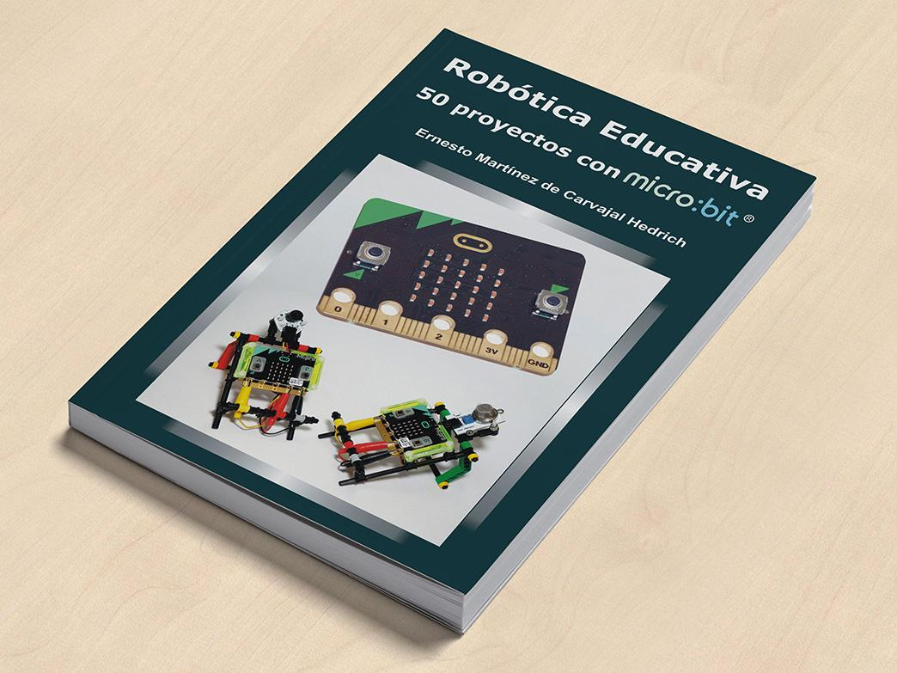

# Disponible para su compra en: [http://microes.org/](https://www.google.com/url?q=http://microes.org/&sa=D&ust=1540996277436000) {#disponible-para-su-compra-en-http-microes-org}

~ ¿Quieres participar en esta guía? ~ 

En Microes.org creamos guías didácticas como la que tienes en tus manos para ayudar a los profesores y usuarios a sacar el máximo partido a micro:bit.

Si eres experto en robótica y tienes algún ejercicio original que quieres compartir con la comunidad ponte en contacto con nosotros.

¿Dudas? ¿Quieres colaborar con la comunidad? Contáctanos:

e-mail: info@microes.org

teléfono: 945 29 80 50  (de 8:00 a 14:00)

Puedes comprar la tarjeta micro:bit e infinidad de complementos compatibles en:

[http://robotopia.es/](https://www.google.com/url?q=http://robotopia.es/&sa=D&ust=1540996277439000)

José Francisco Muñoz (Almeribot.com)  •  Microes.org (Comunidad micro:bit en España)  •