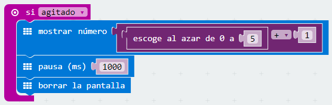
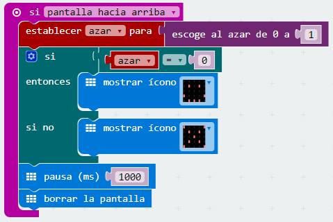

Reto 11\. Dado electrónico.

Un dado es un objeto cúbico usado en juegos de azar. En las caras del cubo aparecen puntos que representan distintos números.

Se propone crear un dado electrónico que, usando el panel LED, muestre el resultado de obtener un número al azar entre 1 y 6.

### Objetivo. {#objetivo}

Tras agitar la micro:BIT, se deberá calcular un número aleatorio cuyo valor esté entre 1 y 6\. Posteriormente, se mostrará en el panel LED el valor obtenido.

### Descripción del código. {#descripci-n-del-c-digo}

Como evento de inicio del programa se usará el bloque si agitado, se mostrará un número escogido al azar entre 0 y 5, al que se le sumará 1\. Se suma 1 dado que el bloque escoge al azar, tiene como valor fijo de inicio el 0.

Tras una pausa de 1 segundo se borra la pantalla, quedando a la espera de que se vuelva agitar la micro:BIT.

### Propuesta. {#propuesta}

Diseñar un programa que permita jugar a la ruleta además se deberá indicar si es rojo o negro o  si gana la banca.

Reto 12\. Cara o cruz.

El juego de cara o cruz es un j[uego](https://www.google.com/url?q=https://es.wikipedia.org/wiki/Juego_de_azar&sa=D&ust=1540996277419000) [de azar](https://www.google.com/url?q=https://es.wikipedia.org/wiki/Juego_de_azar&sa=D&ust=1540996277419000) en el que se emplea una [moneda](https://www.google.com/url?q=https://es.wikipedia.org/wiki/Moneda&sa=D&ust=1540996277420000). Gana quien acierte qué lado de la moneda (de los dos posibles) caerá cara arriba. Cada uno de los dos lados tiene un nombre distintivo y son mencionados como opciones para ser elegidas por los participantes. Por lo tanto, los participantes pueden ser dos equipos o dos personas y así cada bando tiene el 50[%](https://www.google.com/url?q=https://es.wikipedia.org/wiki/%2525&sa=D&ust=1540996277420000) de probabilidades de acertar.

Este juego es frecuentemente empleado como un mecanismo para tomar decisiones o sortear, ya sea entre amigos o en forma informal, pero también es completamente aceptado en ciertas circunstancias, por ejemplo al inicio de un partido de [fútbol](https://www.google.com/url?q=https://es.wikipedia.org/wiki/F%25C3%25BAtbol&sa=D&ust=1540996277420000) profesional.

### Objetivo. {#objetivo-0}

La micro:BIT se situará con el panel LED hacia abajo. Al posicionarlo hacia arriba, se mostrará una cara o una cruz, ganando el que haya escogido la opción mostrada.

### Descripción del código. {#descripci-n-del-c-digo-0}

En primer lugar se creará una variable que se puede llamar “azar”.

Se usará como evento de inicio el bloque si pantalla hacia arriba. A continuación se asigna a la variable “azar”, un valor al azar entre 0 y 1.

Usando el operador lógico si entonces si no se elige como opción es la ganadora. Se asigna la carita feliz si la variable “azar” toma un valor de cero y en caso contrario ganará la cruz. Se mostrará la opción ganadora usando el bloque mostrar icono.

Tras una pausa de un segundo se borra la pantalla.

Para volver a repetir el proceso se deberá poner la micro:BIT con el panel hacia abajo y al volver a poner el panel hacia arriba se repetirá el código programado

.

Para ver el funcionamiento del programa se recomienda volcar el código a una micro:BIT. En el simulador, el proceso no es tan intuitivo.

### Propuesta. {#propuesta-0}

Hacer un programa que permita jugar a “Pares o Nones” contra la micro:BIT