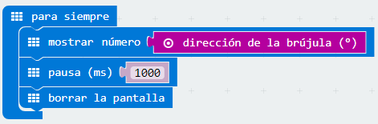
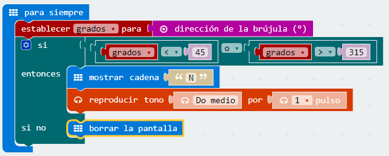

# La brújula detecta el campo magnético terrestre por lo que se puede saber en qué dirección está orientada la micro:bit. (Necesita ser calibrada para asegurar un resultado preciso.) {#la-br-jula-detecta-el-campo-magn-tico-terrestre-por-lo-que-se-puede-saber-en-qu-direcci-n-est-orientada-la-micro-bit-necesita-ser-calibrada-para-asegurar-un-resultado-preciso}

Reto 13\. Conocer la orientación

El norte magnético es la dirección que señala la aguja imantada de una brújula, dirección que no coincide con la del Polo Norte geográfico. Se puede conocer la orientación si se conocen los grados de desviación respecto el Norte Magnético.

### Objetivo. {#objetivo}

Tras calibrar la brújula, nos dirá la desviación en grados respecto al Norte Magnético de la micro:BIT.

### Descripción del código. {#descripci-n-del-c-digo}

Usar el evento para siempre, para iniciar el programa.

Mostrar el valor del sensor dirección de la brújula (º) que ofrece el ángulo de desviación respecto el Norte Magnético.

Esperar 1 segundo y borrar la pantalla.

### Propuesta. {#propuesta}

Cuando la brújula apunte al norte magnético deberá aparecer una flecha apuntando hacia arriba. En caso contrario solo aparecerá el valor numérico.

Reto 14\. Aviso sonoro de orientación Norte.

Cuando se necesita orientarse con un mapa, lo que primero que hay que hacer, es situar el mapa con orientación norte. Para ellos se debe usar una brújula.

### Objetivo. {#objetivo-0}

Crear un programa que mediante un aviso acústico se advierta de que la micro:BIT está orientada al Norte.

### Descripción del código. {#descripci-n-del-c-digo-0}

Usar el evento para siempre, para iniciar el programa.

Crear una variable donde se almacenará el valor del sensor obtenido por el bloque dirección de la brújula (º).

Se introduce el condicional si entonces si no para comprobar en qué intervalo se encuentra el valor obtenido por el sensor.

Si el valor se encuentra entre 315º y 45º la micro:BIT se encuentra orientada al Norte, por lo que se mostrará una N y se reproducirá una nota. Si no se cumple la hipótesis, se borra la pantalla.

### Propuesta. {#propuesta-0}

Hacer un código que ubique de forma más precisa el Norte Magnético.