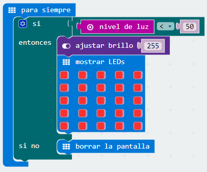

## Reto 7. Interruptor crepuscular.

Cuando la intensidad de la luz cae por debajo de un nivel de iluminación predeterminado y ajustado con anterioridad, el interruptor crepuscular enciende la iluminación. Por el contrario, si la intensidad de la luz es mayor que el nivel prefijado, los interruptores apagan la iluminación.

### Objetivo. {#objetivo}

Crear un programa que mida el nivel luminoso existente, para ello usará el sensor de luz de la micro:BIT. Posteriormente se comprobará si este valor es inferior a 50, si es así, se encenderán todos leds de la placa a su máxima intensidad.

### Descripción del código. {#descripci-n-del-c-digo}

Se usará el evento para siempre, para iniciar el programa. Se introducirá la condición si … entonces, si no, para comprobar si se está por encima o por debajo del valor teórico tomado como límite en esta ocasión 50\. Si el valor es inferior a 50, se fijará la intensidad de los LEDs al máximo usando el bloque ajustar brillo 255. Si el valor es superior a 50 se usará el bloque borrar la pantalla para, de esta forma, apagar todos los LEDs.

El código quedaría de la siguiente forma, se podrá comprobar su funcionamiento variando la intensidad en el simulador de la tarjeta.

### Propuesta. {#propuesta}

Una variante de este reto sería hacer que el brillo de los LED se adapte a la intensidad de la luz media por el sensor. A mayor intensidad recibida por el sensor, menor intensidad de

iluminación y a menor intensidad medida, mayor luminosidad de los LED.