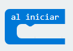
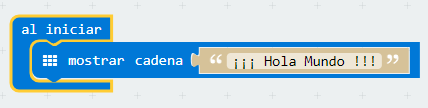

## Reto 1\. Hola Mundo. {#reto-1-hola-mundo}

Cuando se aprende a programar, se llama “Hola Mundo” al primer programa que se crea. Este código imprime el texto «¡Hola Mundo!» en un dispositivo de visualización.

### Objetivo. {#objetivo}

Al conectar la micro:BIT, se debe mostrar el texto «¡¡¡Hola Mundo!!!» en el panel LED de la tarjeta.

### Descripción del código. {#descripci-n-del-c-digo}

Se propone usar el evento al iniciar, situado en la categoría Básico. Este bloque permite ejecutar el código introducido, cuando se inicia la micro:BIT

A continuación se usará el bloque mostrar cadena, también localizado en la categoría Básico e introducir el texto “¡¡¡ Hola Mundo !!!”. Este bloque permite mostrar caracter a caracter, el texto introducido.

El código quedará de la siguiente manera.

De forma inmediata comenzará a leerse en el panel LED la cadena de texto introducida. El texto no cabe en su totalidad por lo que este se desplazará de forma automática.

### Propuesta. {#propuesta}

Modificar el código, para que se muestre el nombre del programador.