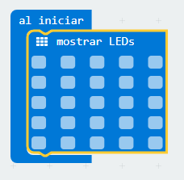
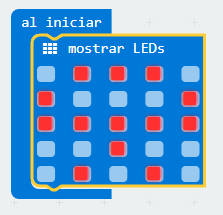
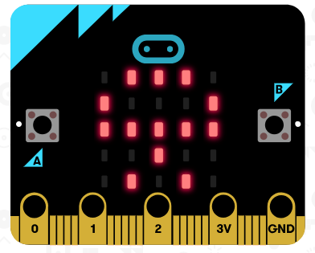

## Reto 3 Diseñando iconos. {#reto-3-dise-ando-iconos}

MakeCode permite diseñar de forma gráfica los iconos a mostrar en el display LED. Para este menester dispone de un bloque específico situado en la categoría Básico. El bloque se llama “mostrar LEDs” y permite al usuario diseñar sus propios iconos marcando de forma independiente los LEDs que se quieren iluminar.

### Objetivo. {#objetivo}

Diseñar un icono con forma de [Indalo](https://es.wikipedia.org/wiki/Indalo). Se trata de una figura rupestre encontrado en una cueva de la provincia de Almería y que representa una figura humana con los brazos extendidos y un arco sobre sus manos. Actualmente se considera un símbolo de la provincia de Almería.

 https://www.youtube.com/watch?v=ag2ulUyaQqg&feature=youtu.be 

### Descripción del código. {#descripci-n-del-c-digo}

Se usará el evento al iniciar, situado en la categoría Básico..

Situar en el interior el bloque anterior, la instrucción “mostrar LEDs”, este se localiza en la categoría Básico. Este bloque permite marcar de forma independiente los LEDs que se quieren encender.

Pulsar sobre los LEDs que se quieren iluminar hasta conseguir el icono deseado.

Deberá aparecer en el simulador el icono con la forma diseñada.

### Propuesta. {#propuesta}

Diseñar un código que muestre un logotipo diseñado por el programador.