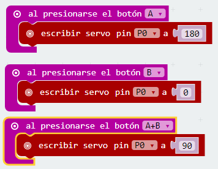

# Pines de entrada y salida {#pines-de-entrada-y-salida}

La micro:BIT dispone de 25 conectores situados en el borde inferior . A través de ellos se podrán programar motores, LEDs o cualquier otro componente o sensor externo.

Reto 17\. Moviendo un servomotor

Un servomotor (también llamado servo) es un dispositivo similar a un motor de corriente continua que tiene la capacidad de ubicarse en cualquier posición dentro de su rango de operación, y mantenerse estable en dicha posición.

### Objetivo. {#objetivo-0}

Diseñar un programa que al pulsar el botón A el servo se posicione a 180º, si se acciona el pulsador B se debe situar a 0º y al pulsar conjuntamente A+B se ubicará a 90º.

### Descripción del código. {#descripci-n-del-c-digo-0}

El bloque escribir servo pin (P0) a (180) que sirve para posicionar el servo, se encuentra ubicado en la categoría Pines, que aparece al pulsar en la sección Avanzado del menú principal.

Se puede elegir en qué pin se conecta el servo y con qué ángulo se posiciona el brazo del servo. Se usará el bloque al presionarse el botón, para iniciar los diferentes programas según el pulsador accionado.

El programa quedará de la siguiente forma:

En el simulador aparece la imagen de un servo y hará lo programado según el pulsador accionado.

### Propuesta. {#propuesta-0}

Crear un código que permita mover el servo en pasos de 15º al pulsar el botón A y devuelva el brazo a 0º al accionar el pulsador B.

~ Biografía del autor ~