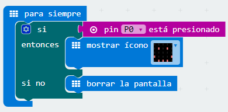

##Reto 16 ¿Hay continuidad?

En algunas ocasiones interesa conocer si un cable tiene continuidad en toda su longitud. Para comprobar la continuidad se suele usar un multímetro, midiendo la resistencia del conductor. Una lectura de resistencia infinita indicaría una interrupción en alguna parte del interior del cable.

### Objetivo. {#objetivo}

Diseñar un programa que permita comprobar si un cable tiene continuidad. Si no está cortado, mostrar una cara feliz.

### Descripción del código. {#descripci-n-del-c-digo}

Se usará el bloque pin (P0) está presionado de la categoría Entrada para comprobar la continuidad. Se propone emplear el evento para siempre y usar un condicional que verifique si el P0 está presionado. Si se cumple la condición se muestra una carita feliz, en caso contrario, el panel permanece apagado. El código podría quedar de la siguiente forma:

Para comprobar el funcionamiento se puede usar un cable con bananas conectados al GND, si se conecta con el P0 y el cable tiene continuidad, deberá aparecer una carita feliz en el panel LED.

### Propuesta. {#propuesta}

Modificar el código para que cuando el cable a comprobar tenga continuidad haga sonar la melodía “jump up” y si no tiene continuidad que se emita la melodía “jump down”.

