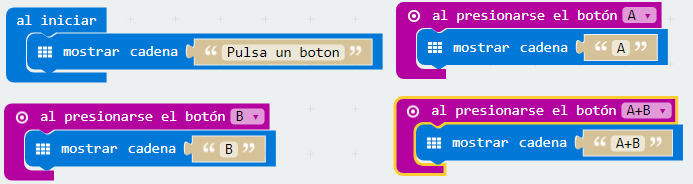
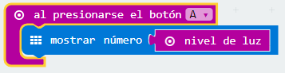
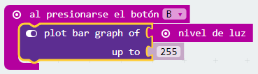
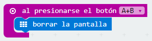
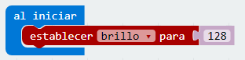
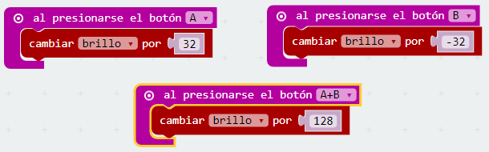
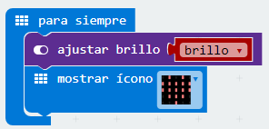

# Pulsadores {#pulsadores}

Hay dos botones en la cara frontal de micro:bit (etiquetados como A y B). Puedes detectar cuando son pulsados de forma independiente o a la vez y ejecutar una acción en cada caso.

Reto 8\. ¿Qué botón has pulsado?

A veces puede interesar usar un pulsador para iniciar, pausar o detener un código o subrutina. Algunos robots incorporan botoneras para esta finalidad.

### Objetivo. {#objetivo}

Crear un programa que muestre en pantalla la letra del pulsador que se ha accionado.

### Descripción del código. {#descripci-n-del-c-digo}

Se usará el bloque al iniciar para que al principio se muestre el texto “Pulsa un botón”. La micro:BIT no muestra caracteres acentuados, por lo que dejará un hueco si se pone la tilde en la palabra botón.

Posteriormente se usará el evento al presionar el botón A  y se introducirá el bloque mostrar cadena donde se sustituirá el texto por defecto por la letra “A”.

Esto mismo se repetirá cuando se pulsa el botón B y la pulsación combinada de A+B.

El código quedaría de la siguiente forma:

### Propuesta. {#propuesta}

Crear una caja de música. Al pulsar el botón A haga hará sonar una melodía. El bloque necesario para hacer sonar una melodía se encuentra en la categoría Música.

Reto 9\. Medir la intensidad de la luz ambiente

Los sensores de luz se usan para detectar el nivel de luminosidad y producir una señal de salida representativa de la cantidad de luz detectada.

En algunas ocasiones puede ser interesante conocer el nivel lumínico que hay en diferentes situaciones y así poder calibrar un dispositivo que dependa del valor de la intensidad luminosa, como puede ser una cámara fotográfica.

MakeCode dispone del bloque nivel de luz en la categoría Entrada, que lee el valor de luz aplicado en la pantalla LED. Este valor se mueve en un rango de 0 (oscuro) a 255 (luminoso).

### Objetivo. {#objetivo-0}

Al presionar sobre el pulsador A se mostrará el valor numérico de la intensidad de la luz ambiente. Al pulsar sobre B, se mostrará gráficamente la intensidad lumínica. Al pulsar A y B de forma simultánea, se apagará la pantalla.

### Descripción del código. {#descripci-n-del-c-digo-0}

Se propone crear tres programas diferentes y que cada uno se inicie según el botón o combinación de botones presionados.

Al pulsar sobre el botón A se mostrará el valor numérico de la intensidad luminosa. Se usará el bloque mostrar número introduciendo el bloque nivel de luz como valor a presentar.

Al pulsar el botón B se encenderán los LEDs necesarios, para mostrar de forma gráfica el valor del nivel de luz. Se usará el bloque plot bar graph of ... up to ... localizado en la sección LED. En primer lugar se introduce el bloque nivel de luz  y en el segundo término se sustituye el valor por defecto por 255, valor máximo que detecta el sensor de luz.

Para terminar se usará la pulsación combinada de los botones A y B para borrar y apagar la pantalla LED.

### Propuesta. {#propuesta-0}

Crear un código que permita encender todos los LEDs del panel de la micro:BIT al pulsar el botón A y apagarlos al pulsar el botón B, pero no se encenderá si el valor del sensor de luz es superior a 175.

Reto 10\. Modificar el brillo de los LEDs

La mayoría de los teléfonos móviles incorporan la posibilidad de modificar la luminosidad de la pantalla, para adaptarse a la luz ambiente.

### Objetivo. {#objetivo-1}

Diseñar un programa que permita modificar la luminosidad de los LEDs, si se pulsa el botón A la luminosidad aumentará, si se acciona el botón B la luminosidad disminuirá. Si se pulsan A+B la luminosidad se situará a un valor intermedio (128).

### Descripción del código. {#descripci-n-del-c-digo-1}

Para iniciar el programa se definirá una variable que se llamará “brillo”. En la categoría Variables se podrá crear una nueva variable o renombrar la que sale por defecto.

Se establecerá un valor inicial de 128 para la variable creada.

Se propone usar pasos por valor de 32 unidades para evidenciar el cambio de brillo en los LEDs, pero se puede usar cualquier otro valor.

Al accionar el pulsador A se aumentará la variable “brillo” en 32 pasos. Al pulsar el botón B se disminuye el valor de la variable “brillo” en 32 pasos. Por último si se pulsa a la vez las teclas A y B se establece el valor inicial de la variable “brillo”.

Ya para terminar faltaría mostrar en el panel LED un icono que muestre los cambios en el brillo de los LEDs. Se debe usar la variable “brillo” como valor que toma el bloque ajustar brillo

### Propuesta. {#propuesta-1}

Se propone como reto hacer un código que ajuste el brillo de forma automática, a mayor luminosidad medida por el sensor de luz, mayor valor del brillo de los LEDs.