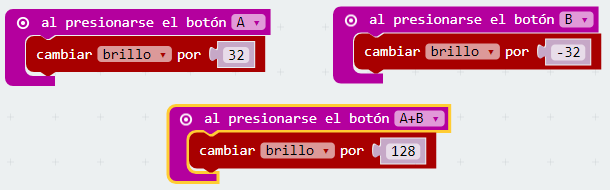

##Reto 10 Modificar el brillo de los LEDs

La mayoría de los teléfonos móviles incorporan la posibilidad de modificar la luminosidad de la pantalla, para adaptarse a la luz ambiente.

### Objetivo. {#objetivo-1}

Diseñar un programa que permita modificar la luminosidad de los LEDs, si se pulsa el botón A la luminosidad aumentará, si se acciona el botón B la luminosidad disminuirá. Si se pulsan A+B la luminosidad se situará a un valor intermedio (128).

### Descripción del código. {#descripci-n-del-c-digo-1}

Para iniciar el programa se definirá una variable que se llamará “brillo”. En la categoría Variables se podrá crear una nueva variable o renombrar la que sale por defecto.

Se establecerá un valor inicial de 128 para la variable creada.

Se propone usar pasos por valor de 32 unidades para evidenciar el cambio de brillo en los LEDs, pero se puede usar cualquier otro valor.

Al accionar el pulsador A se aumentará la variable “brillo” en 32 pasos. Al pulsar el botón B se disminuye el valor de la variable “brillo” en 32 pasos. Por último si se pulsa a la vez las teclas A y B se establece el valor inicial de la variable “brillo”.

Ya para terminar faltaría mostrar en el panel LED un icono que muestre los cambios en el brillo de los LEDs. Se debe usar la variable “brillo” como valor que toma el bloque ajustar brillo

### Propuesta. {#propuesta-1}

Se propone como reto hacer un código que ajuste el brillo de forma automática, a mayor luminosidad medida por el sensor de luz, mayor valor del brillo de los LEDs.