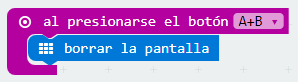

##Reto 9 Medir la intensidad de la luz ambiente

Los sensores de luz se usan para detectar el nivel de luminosidad y producir una señal de salida representativa de la cantidad de luz detectada.

En algunas ocasiones puede ser interesante conocer el nivel lumínico que hay en diferentes situaciones y así poder calibrar un dispositivo que dependa del valor de la intensidad luminosa, como puede ser una cámara fotográfica.

MakeCode dispone del bloque nivel de luz en la categoría Entrada, que lee el valor de luz aplicado en la pantalla LED. Este valor se mueve en un rango de 0 (oscuro) a 255 (luminoso).

### Objetivo. {#objetivo-0}

Al presionar sobre el pulsador A se mostrará el valor numérico de la intensidad de la luz ambiente. Al pulsar sobre B, se mostrará gráficamente la intensidad lumínica. Al pulsar A y B de forma simultánea, se apagará la pantalla.

### Descripción del código. {#descripci-n-del-c-digo-0}

Se propone crear tres programas diferentes y que cada uno se inicie según el botón o combinación de botones presionados.

Al pulsar sobre el botón A se mostrará el valor numérico de la intensidad luminosa. Se usará el bloque mostrar número introduciendo el bloque nivel de luz como valor a presentar.

Al pulsar el botón B se encenderán los LEDs necesarios, para mostrar de forma gráfica el valor del nivel de luz. Se usará el bloque plot bar graph of ... up to ... localizado en la sección LED. En primer lugar se introduce el bloque nivel de luz  y en el segundo término se sustituye el valor por defecto por 255, valor máximo que detecta el sensor de luz.

Para terminar se usará la pulsación combinada de los botones A y B para borrar y apagar la pantalla LED.

### Propuesta. {#propuesta-0}

Crear un código que permita encender todos los LEDs del panel de la micro:BIT al pulsar el botón A y apagarlos al pulsar el botón B, pero no se encenderá si el valor del sensor de luz es superior a 175.

