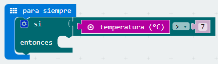
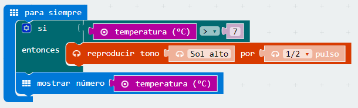

##Reto 6 Temperatura óptima de una nevera

La temperatura óptima de un frigorífico es de 7ºC, mientras que la temperatura de un congelador debe estar entorno a los -18ºC. Algunas neveras incorporan un avisador acústico que se activa cuando la temperatura no es la óptima.

### Objetivo. {#objetivo-1}

Mostrar en el panel LED de la micro:BIT la temperatura del frigorífico y activar una alarma cuando la temperatura esté por encima de 7ºC

 https://www.youtube.com/watch?v=AJHt2rd805E&feature=youtu.be 

### Descripción del código. {#descripci-n-del-c-digo-1}

En este reto se incorpora un altavoz como actuador externo. Se conectará uno de los polos al GND y el otro al PIN 0.

Para iniciar el programa se usará el bloque “para siempre”. Dentro se situará el condición “si entonces”. La condición a verificar será: si la temperatura es mayor de 7 grados.

Si el valor es verdadero entonces se reproducirá un tono de aviso.

También se muestra la temperatura medida.

En el simulador se puede variar la temperatura para comprobar el correcto funcionamiento del programa.

### Propuesta. {#propuesta-1}

Modificar el código para monitorizar el congelador.