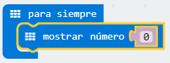
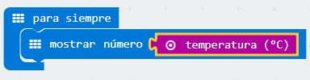
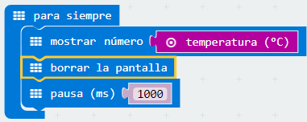
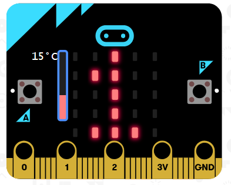

## Reto 4 Termómetro digital.   {#reto-4-term-metro-digital}

Un termómetro es un instrumento que sirve para medir la temperatura; el más habitual consiste en un tubo capilar de vidrio cerrado y terminado en un pequeño depósito que contiene una cierta cantidad de mercurio o alcohol, el cual se dilata al aumentar la temperatura o se contrae al disminuir y cuyas variaciones de volumen se leen en una escala graduada.

Los termómetros digitales son aquellos que, valiéndose de dispositivos [transductores](https://www.google.com/url?q=https://es.wikipedia.org/wiki/Transductor&sa=D&ust=1540996277397000), utilizan circuitos electrónicos para [convertir](https://www.google.com/url?q=https://es.wikipedia.org/wiki/Conversor_anal%25C3%25B3gico-digital&sa=D&ust=1540996277398000) en números las pequeñas variaciones de tensión obtenidas, mostrando finalmente la temperatura en un [visualizador](https://www.google.com/url?q=https://es.wikipedia.org/wiki/Visualizador&sa=D&ust=1540996277399000).

### Objetivo. {#objetivo}

Mostrar en el panel LED la temperatura detectada por el sensor de temperatura integrado en la micro:BIT.

 https://www.youtube.com/watch?v=Avl3wo4Rkww&feature=youtu.be 

### Descripción del código. {#descripci-n-del-c-digo}

Se propone iniciar el programa usando el evento “para siempre”. Añadir el bloque, localizado en la categoría Básico, mostrar número. Este bloque muestra en la pantalla LED el número introducido, desplazándose si es mayor de 1 cifra.

Sustituir el número “0” por el valor obtenido del sensor de temperatura. Este bloque se localiza en la categoría Entrada. 

A continuación se borra la pantalla y se introduce una pausa de 1000 ms. Quedando el programa de la siguiente forma:

En el simulador aparecerá una barra vertical que permite modificar la temperatura, siendo la temperatura marcada la mostrada en el panel LED.

### Propuesta. {#propuesta}

Hacer un programa que al pulsar el botón A muestra la temperatura en grados celsius y al pulsar el botón B la temperatura mostrada sea en grados Fahrenheit.

