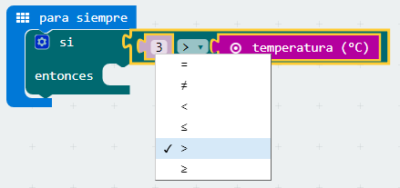
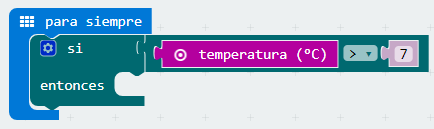

## Reto 4\. Termómetro digital.   {#reto-4-term-metro-digital}

Un termómetro es un instrumento que sirve para medir la temperatura; el más habitual consiste en un tubo capilar de vidrio cerrado y terminado en un pequeño depósito que contiene una cierta cantidad de mercurio o alcohol, el cual se dilata al aumentar la temperatura o se contrae al disminuir y cuyas variaciones de volumen se leen en una escala graduada.

Los termómetros digitales son aquellos que, valiéndose de dispositivos [transductores](https://www.google.com/url?q=https://es.wikipedia.org/wiki/Transductor&sa=D&ust=1540996277397000), utilizan circuitos electrónicos para [convertir](https://www.google.com/url?q=https://es.wikipedia.org/wiki/Conversor_anal%25C3%25B3gico-digital&sa=D&ust=1540996277398000) en números las pequeñas variaciones de [tensión](https://www.google.com/url?q=https://es.wikipedia.org/wiki/Tensi%25C3%25B3n_(electricidad)&sa=D&ust=1540996277398000) obtenidas, mostrando finalmente la temperatura en un [visualizador](https://www.google.com/url?q=https://es.wikipedia.org/wiki/Visualizador&sa=D&ust=1540996277399000).

### Objetivo. {#objetivo}

Mostrar en el panel LED la temperatura detectada por el sensor de temperatura integrado en la micro:BIT.

### Descripción del código. {#descripci-n-del-c-digo}

Se propone iniciar el programa usando el evento “para siempre”. Añadir el bloque, localizado en la categoría Básico, mostrar número. Este bloque muestra en la pantalla LED el número introducido, desplazándose si es mayor de 1 cifra.

Sustituir el número “0” por el valor obtenido del sensor de temperatura. Este bloque se localiza en la categoría Entrada. 

A continuación se borra la pantalla y se introduce una pausa de 1000 ms. Quedando el programa de la siguiente forma:

En el simulador aparecerá una barra vertical que permite modificar la temperatura, siendo la temperatura marcada la mostrada en el panel LED.

### Propuesta. {#propuesta}

Hacer un programa que al pulsar el botón A muestra la temperatura en grados celsius y al pulsar el botón B la temperatura mostrada sea en grados Fahrenheit.

Reto 5\. Aviso de placas de hielo.

La mayoría de coches incorporan en el salpicadero, junto a la pantalla que marca la temperatura exterior, un testigo con forma de copo de nieve, que avisa de la posibilidad de que haya placas de hielo en la carretera. Este testigo se suele iluminar cuando la temperatura baja de 3 grados centígrados.

### Objetivo. {#objetivo-0}

Mostrar en el panel LED de la micor:BIT un icono con forma de copo de nieve cuando la temperatura esté por debajo de 3 grados.

### Descripción del código. {#descripci-n-del-c-digo-0}

Para iniciar el programa, se propone usar el evento para siempre. Posteriormente se debe añadir el operador lógico si … entonces situado en la sección Lógica. Este bloque verifica si es verdad que se cumple una condición, si es así, ejecuta las instrucciones introducidas.

Para comprobar si la temperatura está por debajo de los 3º centígrados se usará el operador que devuelve verdadero siempre que 3 sea mayor que el valor reportado por el sensor de temperatura. El bloque se localiza en la categoría Lógica.

Para mostrar un icono con forma de copo de nieve se usará el bloque mostrar LED, también se debe añadir el bloque borrar la pantalla para que no se quede encendido el panel LED cuando suba la temperatura de 3º centígrados

Una vez terminado el código, aparecerá el símbolo de hielo, cuando la temperatura sea menor de 3º centígrados.

### Propuesta. {#propuesta-0}

Añadir un aviso sonoro cuando la temperatura sea inferior a 3 grados celsius.

Reto 6\. Temperatura óptima de una nevera

La temperatura óptima de un frigorífico es de 7ºC, mientras que la temperatura de un congelador debe estar entorno a los -18ºC. Algunas neveras incorporan un avisador acústico que se activa cuando la temperatura no es la óptima.

### Objetivo. {#objetivo-1}

Mostrar en el panel LED de la micro:BIT la temperatura del frigorífico y activar una alarma cuando la temperatura esté por encima de 7ºC

### Descripción del código. {#descripci-n-del-c-digo-1}

En este reto se incorpora un altavoz como actuador externo. Se conectará uno de los polos al GND y el otro al PIN 0.

Para iniciar el programa se usará el bloque “para siempre”. Dentro se situará el condición “si entonces”. La condición a verificar será: si la temperatura es mayor de 7 grados.

Si el valor es verdadero entonces se reproducirá un tono de aviso.

También se muestra la temperatura medida.

En el simulador se puede variar la temperatura para comprobar el correcto funcionamiento del programa.

### Propuesta. {#propuesta-1}

Modificar el código para monitorizar el congelador.